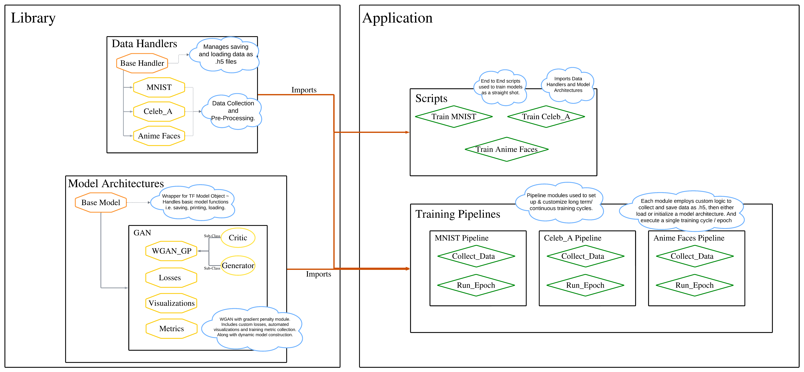

# Generative AI - Face Generation

Generative AI project to explore the generation of unique faces. This project showcases both ML Ops and WGAN with gradient penalties to generate photo realistic images of both human and anime faces.

## Training Results

-------

## WGAN With Gradient Penalty

Generative Advisarial Networks

## ML Ops and Continuous Development

The project structure is designed to facilitate a smoother development experience for building or modifying models.

The project is divided into two main components: a library and an application.

The library comprises independent modules, including data handlers, OS managers, and model architectures. These modules can be imported by scripts in the application.

The Application component utilizes the modules in the library to streamline the process of data collection/processing, model architecture initialization/tuning, and training cycles. The goal is to empower data scientists to conduct much, if not all, of the model development and experimentation without the need to engage with boilerplate code or complex control logic for each model.

This component primarily consists of training scripts or pipelines. Each script loads and preprocesses data using the data handlers, then initializes and trains a model using a model architecture module. This approach enables different scripts to correspond to various training parameters, allowing developers to conduct numerous experiments without altering the model architecture class extensively.



## Library

### Data Handlers

They encapsulate functionality for loading, preprocessing, and saving data, which helps ensure consistency and reproducibility across different parts of the project. By abstracting away the details of data manipulation, data handlers allow developers to focus on higher-level tasks such as model building and experimentation. Additionally, they facilitate data pipeline management, making it easier to handle large datasets efficiently.

### Model Architectures

Model architectures modules provide a framework for dynamically initializing TensorFlow models and managing training-related tasks. They encapsulate the logic for defining neural network architectures, including layers, activation functions, and optimization algorithms. Furthermore, these modules automate the collection and storage of training metrics and visualizations, such as loss curves and model performance summaries. By abstracting away the complexities of model construction and training, model architectures modules streamline the development process and enable rapid experimentation with different network configurations.

### Manager Utils

Manager Utils is a project management module that offers utilities for maintaining consistency and control within the project repository. It provides functions for tasks such as file validation, creation, and deletion, ensuring that project files are managed effectively and adhere to predefined standards. Moreover, Manager Utils serves as a foundational component for other modules in the library, offering reusable functionality that can be inherited and extended by other modules. This promotes code reuse, modularity, and maintainability across the project.

## Application

### Training Scripts

Training scripts are standalone files that encompass the entire training process for machine learning models in a single execution. They typically involve tasks such as data collection, model initialization, training loop execution, and result analysis. Training scripts are suitable for small-scale experiments or end-to-end testing scenarios where a complete training cycle needs to be executed in one go. They offer simplicity and convenience for quickly testing model implementations or validating hypotheses without the need for complex orchestration.

### Pipelines

Pipelines modules are designed to orchestrate complex machine learning workflows by breaking down experiments into modular components. Each component, such as data collection, model initialization, and training execution, is encapsulated within its own script, allowing for fine-grained control over experiment parameters and execution flow. Pipelines facilitate longer or continuous experiments by providing a structured approach to managing experiments and training cycles. One key advantage of using pipelines is the ability to switch out component scripts dynamically during runtime or without interrupting training, offering flexibility and scalability in managing experimentation processes.

-------

## Getting Up and Running

### Operational Pre-requisites

Build automation is run with a `Makefile` and so you must be able to run Makefiles

If you have linux, disregard the next prerequite steps.

#### Install `make`  

For Mac OS  

```console
brew install make
```

For Windows  

```console
choco install make
```

Note, automation is handled in the Makefile in the root directory, which is setup to accomodate any operating system. (Unix/Linux/MacOS and Windows)

### Initialize Project

cd into the root repo directory and run `make install` to install packages and compile project packages.  
Note: Project dependencies will be stored in a virtual environment `venv` tailered to the repository.

Ensure the project is working correctly by running unit tests with,

```console
make test
```

### Other Makefile and Project Management Commands

Makefile Usage:
To clean build artifacts: `make clean_target`  
To clean the virtual environment: `make clean_venv`  
To set up the virtual environment and install dependencies: `make install`  
To compile the project: `make compile`  
To run tests: `make test`  
To build distribution packages: `make build`  

## Run the Code

### Quick Start  

~ cd into the root directory and run,

```console
make train_mnist
```

This will launch a training script that installs the MNIST dataset, initializes a GAN architecture, and begins a training cycle.  

During training, model metrics loss graphs, and visualizationss will automatically be added to the `/models/MNIST/WGAN_GP/visualizations` directory.  

Visualizations include, loss plots, generated samples, and histogram distribution of weights in both the critic and generator networks.

once training is complete the  model will be saved to `/models/MNIST/WGAN_GP/saved_models/` Directory.  

### Training Anime Faces

The anime faces data handler requires information about where the dataset is stored.

Download the data set here: https://www.kaggle.com/datasets/splcher/animefacedataset

next, unzip the dataset in `data/`

This is the default location the anime faces data handler will look for the dataset, this can also be modified to collect data from a different folder.

Once the data is stored in the correct location, run

```console
make train_anime_faces
```

to launch the training script for anime faces.

Similar to the MNIST training cycle, loss graphs and visualizations will be created in `/models/AnimeFaces/WGAN_GP/visualizations/` directory, and the model will be saved in `/models/AnimeFaces/WGAN_GP/saved_models/` directory.  

This dataset can take a while to train, and so it is recommended to instead run the anime faces training pipeline with,

```console
make pipeline_train_animeFaces
```

this will run 150 isolated epochs by default and continuously save the model after every epoch.  

### Training Celeb Faces

Similar to the anime faces data handler, the celeb faces data handler requires information about where the dataset is stored.

Download the data set here: https://www.kaggle.com/datasets/jessicali9530/celeba-dataset

next, unzip the dataset in `data/`

This is the default location the celeb faces data handler will look for the dataset, this can also be modified to collect data from a different folder.

Once the data is stored in the correct location, run

```console
make train_celeb_faces
```

to launch the training script for celeb faces.

Similar to the MNIST training cycle, loss graphs and visualizations will be created in `/models/CelebFaces/WGAN_GP/visualizations` directory, and the model will be saved in `/models/CelebFaces/WGAN_GP/saved_models` directory.  

This dataset can take a while to train, and so it is recommended to instead run the celeb faces training pipeline with,

```console
make pipeline_train_celebFaces
```

this will run 150 isolated epochs by default and continuously save the model after every epoch.  
